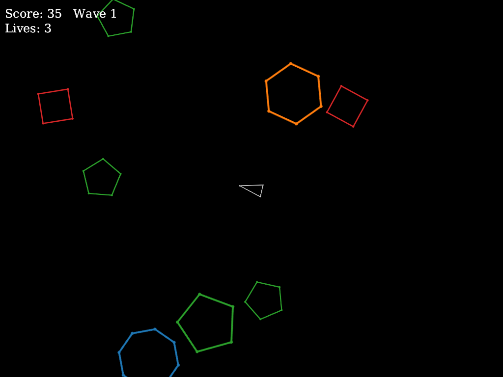
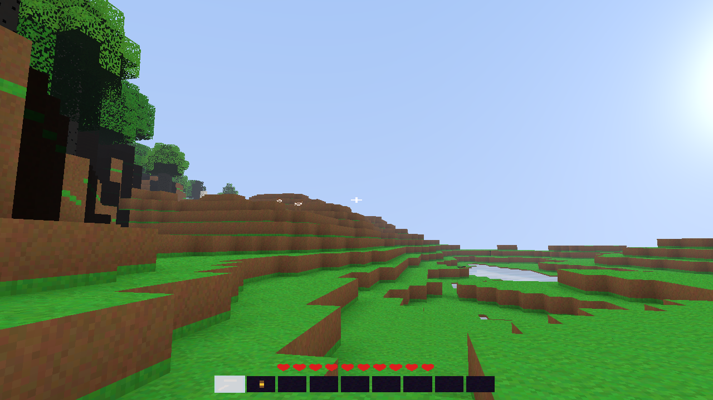

# Raster

[](https://clojars.org/org.replikativ/raster)
[](https://circleci.com/gh/replikativ/raster)
[](https://clojurians.slack.com/archives/C09622F337D)
[](https://replikativ.github.io/raster/)

**Fast numerical computing for Clojure.**

Write math with `deftm`, get world-class numerical performance on the JVM —
with full REPL interactivity, automatic differentiation, and GPU compilation.

```clojure
(require '[raster.core :refer [deftm ftm]])
(require '[raster.numeric :refer [+ *]])
(require '[raster.math :refer [sqrt]])

;; Typed function — compiles to primitive JVM bytecode, no boxing
(deftm norm [x :- Double, y :- Double] :- Double
  (sqrt (+ (* x x) (* y y))))

(norm 3.0 4.0) ;; => 5.0
```

## Try It

🎮 **Play the live demos — no install** (WebGPU, Chrome/Edge):
**[Geometric Asteroids](https://replikativ.github.io/raster/asteroids/)** ·
**[Valley](https://replikativ.github.io/raster/valley/)** — both run from one
`.cljc` codebase with the numerical kernels compiled to WebAssembly.

To explore the library itself:

```bash
# Clone and start a REPL
git clone https://github.com/replikativ/raster.git
cd raster
clojure -M:nREPL
```

Then open one of the [interactive notebooks](notebooks/raster/) in your editor
(Kindly/Clay compatible):

| Notebook | What you'll learn |
|----------|-------------------|
| [Getting Started](notebooks/raster/getting_started.clj) | `deftm`, typed dispatch, value types |
| [Automatic Differentiation](notebooks/raster/autodiff.clj) | Forward-mode, reverse-mode, `value+grad` |
| [ODE Solvers](notebooks/raster/ode_solvers.clj) | Lorenz attractor, adaptive solvers, events |
| [Linear Algebra](notebooks/raster/linear_algebra.clj) | Vec/Mat types, LU, Cholesky, SVD |
| [Optimization](notebooks/raster/optimization.clj) | L-BFGS, Nelder-Mead, Newton's method |
| [Deep Learning](notebooks/raster/deep_learning.clj) | MLP training with compiled AD |
| [Agent-Based Modeling](notebooks/raster/abm_firms.clj) | Endogenous firm formation, GPU-compiled |
| [Geometric Algebra + ODE](notebooks/raster/ga_ode_rotors.clj) | Rotors, precession |

### Game Examples

Playable demos of typed dispatch, parallel primitives, and procedural generation:

| | |
|---|---|
| [](https://replikativ.github.io/raster/asteroids/) | [](https://replikativ.github.io/raster/valley/) |

▶ Play in the browser: **[Asteroids](https://replikativ.github.io/raster/asteroids/)** ·
**[Valley](https://replikativ.github.io/raster/valley/)** (WebGPU — Chrome/Edge).

- **[Geometric Asteroids](examples/asteroids/)** — polygon shapes via `defvalue` + `deftm`
  dispatch; add new shape types from the REPL during gameplay. Cross-platform from one
  `.cljc` codebase: runs on the JVM (Vulkan) and in the browser (WebGPU, physics compiled
  to WebAssembly).
- **[Valley](examples/valley/)** — a streaming voxel world (biome terrain, caves, ore veins,
  trees, day/night sky, skylight + glowstone block-light, water, passive mobs, mining).
  Also cross-platform: the same kernels compile to JVM bytecode + Vulkan and to WebAssembly
  + WebGPU.

There's also a [Doom-style renderer](examples/doom/) (WAD loading + BSP traversal, WIP).

See [examples/README.md](examples/README.md) for running instructions.

## Cross-platform: one codebase, JVM and the browser

The two games above run from one Clojure(Script) source on two very different targets —
desktop (JVM + Vulkan) and the browser (WebAssembly + WebGPU). What makes that work is
that the two *performance-critical* layers compile to native code on **each** platform:

- **Numerical kernels (`deftm`/`defvalue`) → JVM bytecode _and_ WebAssembly.** The terrain
  noise, biome/cave generation, and AABB + batch physics are written once as typed
  functions over primitive arrays and value types. `compile-aot` turns them into primitive
  JVM bytecode (no boxing) on the desktop and into an **f64 WebAssembly module** (via
  `raster.compiler.cljs-emit`) in the browser — so you don't rewrite the hot math in JS,
  Rust or C for the web. The same `deftm` kernels run native on both. `defvalue` value types
  (e.g. `Shape`, `Vec3`) stay unboxed and marshal across the wasm boundary as flat structs.
- **Rendering (`raster.render`) → Vulkan _and_ WebGPU.** Both games draw against one small
  renderer protocol, and one shader description emits both GLSL (Vulkan) and WGSL (WebGPU).
  One renderer, two GPU APIs.

The split is deliberate, and worth being clear about: **`deftm`/`defvalue` carry the
numerics that must be fast everywhere; the orchestration** (streaming, meshing, the game
loop) **is ordinary portable `.cljc`** — JavaScript in the browser, bytecode on the JVM,
the same as any Clojure(Script). The wasm target is a numeric subset (flat memory + value
types + control flow, compiled ahead of time), so what crosses to the browser is the
kernel set, not the whole program; `deftm`'s runtime multiple dispatch and REPL
redefinition stay JVM-only (ClojureScript has no `deftm` runtime). For a voxel game that
boundary lands naturally — terrain and physics are the hot numerics, everything else is
glue.

## Why Raster?

Clojure is great for data-driven applications, but numerical computing has
traditionally required dropping to Java or calling out to Python. Raster fills
that gap with three ideas:

1. **Typed multiple dispatch** (inspired by [Julia](https://julialang.org/)) —
   define the same function for different types and the most specific method is
   selected automatically. The compiler resolves dispatch at call sites when
   the consumer's argument types are known — either by selecting the closest
   concrete method or by specializing a parametric template — and emits JVM
   bytecode with zero overhead.

2. **Parallel combinators** (inspired by [Futhark](https://futhark-lang.org/)) —
   express data parallelism with `par/map`, `par/reduce`, and `par/scan`. The
   compiler treats these as first-class IR nodes, fuses producer-consumer chains
   (SOAC fusion), and lowers them to SIMD loops, OpenCL kernels, or Vulkan
   compute — from the same source code.

3. **End-to-end compilation** — a transparent nanopass compiler that you own and
   can inspect. Because we compile from Clojure source to JVM bytecode directly
   (no LLVM dependency), we control every optimization pass and can target
   multiple backends: JVM bytecode with SIMD vectorization, OpenCL C, Vulkan
   SPIR-V, or Intel Level Zero. The pipeline is fully inspectable via
   `explain-pipeline`. We can also emit C or potentially LLVM IR when needed,
   but the default path avoids external toolchain dependencies entirely.

This combination — typed dispatch for abstraction, parallel combinators for
structure, and a self-contained compiler for performance — is how Raster aims to
match JAX-level deep learning performance while remaining a regular Clojure
library with full REPL interactivity.

### What this enables

- **Clojure-native** — `deftm` is a macro, not a DSL. Your functions are
  regular Clojure values that work at the REPL, in tests, with your editor.
- **Fast** — the compiler fuses array operations across function boundaries,
  hoists buffer allocations, and vectorizes loops. Competitive with Julia and
  JAX on numerical workloads.
- **Composable** — functions compose naturally. Write a loss function, take
  its gradient, compile the training step — all with the same `deftm` functions.
  `compile-aot` inlines entire call chains into a single JVM method with zero
  heap allocations in the hot path.
- **Multi-backend** — the same `par/map` expression runs as a sequential loop
  at the REPL, a SIMD-vectorized loop in compiled JVM code, or a GPU kernel on
  OpenCL/Vulkan/Level Zero.

### Performance

All benchmarks on Valhalla JDK 27, single-threaded CPU unless noted.
GPU benchmarks on Intel Arc A770 (Level Zero).

| Workload | Raster | Reference | vs Reference |
|----------|--------|-----------|--------------|
| ODE solve (DP5 Lorenz, t=100) | 432 µs | Julia DiffEq 583 µs | **1.4x faster** |
| MLP 784-128-10 train step (f64) | 136 µs | JAX CPU 86 µs | JAX 1.6x faster |
| MLP 784-128-10 train step (f32) | 77 µs | JAX CPU 50 µs | JAX 1.5x faster |
| LeNet-5 train step (f64) | 222 µs | JAX CPU 370 µs | **1.7x faster** |
| LeNet-5 train step (f32) | 148 µs | JAX CPU 356 µs | **2.4x faster** |
| AD sensitivity (Lotka-Volterra, Dual4) | 15 µs | Julia ForwardDiff 16 µs | **1.1x faster** |
| ABM 10M agents/period (GPU) | 172 ms | CPU-parallel 459 ms | **2.7x faster** |

The DL numbers include the full compiled pipeline: forward pass, reverse-mode AD
backward pass, and SGD parameter update — compiled to a single JVM method via
`compile-aot`. Zero heap allocations in the hot path. Dense layers use fused
`par/map` + `par/reduce` SOACs (no BLAS calls) — the same strategy as Futhark
and XLA's CPU backend. BLAS via Panama FFI (`cblas_dgemv`/`cblas_dgemm`) is
available for explicit use in large batched GEMM workloads.

## Core Concepts

### Typed Functions: `deftm` and `ftm`

`deftm` (typed multi) defines functions with type annotations and multiple dispatch:

```clojure
;; Multiple dispatch — same name, different types
(deftm norm [x :- Double, y :- Double] :- Double
  (sqrt (+ (* x x) (* y y))))

(deftm norm [x :- Float, y :- Float] :- Float
  (sqrt (+ (* x x) (* y y))))

(norm 3.0 4.0)              ;; => 5.0 (Double path)
(norm (float 3) (float 4))  ;; => 5.0 (Float path, no boxing)

;; Typed lambdas
(deftm apply-twice [f :- (Fn [Double] Double), x :- Double] :- Double
  (f (f x)))

(apply-twice (ftm [x :- Double] :- Double (* x x)) 3.0) ;; => 81.0
```

Use `deftm`/`ftm` for all numerical code. Use plain `defn` for glue code,
configuration, and I/O.

### Parallel Combinators

`raster.par` provides declarative parallel primitives that the compiler can
fuse, vectorize, and lower to different backends:

```clojure
(require '[raster.par :as par])

;; Element-wise map — returns a new array
(deftm relu [xs :- (Array double)] :- (Array double)
  (par/map [i (alength xs)]
    (Math/max 0.0 (aget xs i))))

;; Dot product — fused map + reduce
(deftm dot [xs :- (Array double), ys :- (Array double)] :- Double
  (par/reduce + 0.0 [i (alength xs)]
    (* (aget xs i) (aget ys i))))
```

When composed, the compiler fuses adjacent `par/map` and `par/reduce` operations
into single loops — no intermediate arrays are allocated. This is the same
SOAC (Second-Order Array Combinator) fusion strategy pioneered by
[Futhark](https://futhark-lang.org/), applied here within a general-purpose
host language rather than a standalone array language.

### Polymorphic Arithmetic

`raster.numeric` provides `+`, `-`, `*`, `/` and friends that dispatch on
concrete types — Long stays Long, Float stays Float:

```clojure
(+ 1 2)                    ;; Long + Long -> Long
(+ 1.0 2.0)                ;; Double + Double -> Double
(+ (float 1) (float 2))    ;; Float + Float -> Float
```

### Automatic Differentiation

Forward-mode (Dual numbers) and reverse-mode (IR source transformation):

```clojure
(require '[raster.ad :refer [value+grad grad]])

(deftm rosenbrock [x :- Double, y :- Double] :- Double
  (let [a (- y (* x x))
        b (- 1.0 x)]
    (+ (* 100.0 a a) (* b b))))

;; value+grad returns [f(x), ∇f(x)]
(value+grad rosenbrock 1.0 1.0) ;; => [0.0 [0.0 0.0]]
```

### Compilation

For maximum performance, `compile-aot` inlines an entire call chain —
forward pass, AD, optimizer update — into a single JVM method:

```clojure
(require '[raster.compiler.pipeline :as pipeline])

(def fast-step (pipeline/compile-aot #'train-step!))
```

The compiler performs buffer fusion (reusing dead arrays), SOAC fusion
(merging parallel combinator chains), and emits SIMD-vectorized loops — all
automatically from your `deftm` source.

Use `(pipeline/explain-pipeline #'my-fn)` to see what each compiler pass does.

## What's Included

### Scientific Computing

| Module | Description |
|--------|-------------|
| `raster.ode` | ODE solvers (Euler, RK4, DP5, Tsit5), PDE (method-of-lines), SDE |
| `raster.sci.optim` | L-BFGS, Nelder-Mead, Newton, gradient descent |
| `raster.linalg` | Dense linear algebra, LU, Cholesky, SVD, QR, eigendecomposition |
| `raster.linalg.iterative` | Krylov methods (CG, GMRES, BiCGSTAB) |
| `raster.linalg.sparse` | Sparse vectors and matrices |
| `raster.sci.interpolation` | Linear, cubic spline, Akima, PCHIP, 2D bilinear/bicubic |
| `raster.sci.fft` | Fast Fourier Transform |
| `raster.sci.quadrature` | Numerical integration (Gauss-Kronrod, Simpson) |
| `raster.sci.roots` | Root finding (bisection, Brent, Newton) |
| `raster.sci.distributions` | Normal, Uniform, Exponential, Gamma, Poisson |
| `raster.sci.stats` | t-tests, chi-squared, KS test, correlation |
| `raster.sci.special` | Gamma, beta, error functions |

### Deep Learning

| Module | Description |
|--------|-------------|
| `raster.dl.nn` | Linear, conv1d/2d, maxpool, normalization, activations |
| `raster.dl.attention` | Scaled dot-product and multi-head attention |
| `raster.dl.loss` | MSE, cross-entropy, Huber, L1 (with AD rules) |
| `raster.dl.optim` | SGD, Adam, AdamW, learning rate schedulers |
| `raster.dl.einsum` | Einstein summation and einops-style rearrangement |
| `raster.dl.diffusion` | DDPM noise schedules and sampling |

All layers are `deftm` functions on flat arrays — the compiler sees through
layer boundaries and fuses operations end-to-end. See the
[LeNet-5](examples/raster/dl/lenet.clj) and [GPT-2](examples/raster/dl/gpt2.clj)
examples.

### Symbolic and Algebraic

| Module | Description |
|--------|-------------|
| `raster.sym` | Symbolic expressions, differentiation, Taylor series |
| `raster.ga` | Geometric algebra Cl(p,q,r) with compiled multivector types |
| `raster.types.complex` | Complex number arithmetic |

### GPU Computing

The same parallel combinators (`par/map`, `par/reduce`, `par/scan`) that run as
SIMD-vectorized loops on CPU compile to GPU kernels through backend passes.
Backends: OpenCL (NVIDIA, AMD, Intel), Intel Level Zero, Vulkan compute, JDK
Vector API SIMD.

See [GPU Computing](doc/gpu.md) for the session API and backend details.

### Simulation

[`raster.abm`](notebooks/raster/abm_firms.clj) — a GPU-accelerated agent-based
model of firm formation and labor markets. Same Clojure source runs on CPU and
GPU. Includes a differentiable variant for gradient-based parameter calibration.

## Under the Hood

Raster's compiler is a nanopass pipeline: each pass transforms a small,
well-defined IR dialect. Dispatch resolution, type inference, AD expansion,
SOAC fusion, buffer allocation, and backend code generation are all separate
passes that you can inspect individually.

| Document | Description |
|----------|-------------|
| [Compiler Pipeline](doc/compiler.md) | Nanopass architecture, passes, `compile-aot`, diagnostics |
| [Automatic Differentiation](doc/autodiff.md) | Forward/reverse AD, rrules, sensitivity analysis |
| [GPU Computing](doc/gpu.md) | Parallel primitives, session API, backends, SoA layout |
| [Deep Learning](doc/deep-learning.md) | Layers, loss, optimizers, compiled training |

Built on [TypedClojure](https://github.com/typedclojure/typedclojure) for
type inference and [beichte](https://github.com/replikativ/beichte) for
purity analysis.

## Project Structure

```
src/raster/
  core.clj                -- deftm, ftm, defvalue, specialize macros
  numeric.clj             -- polymorphic +, -, *, /, comparisons
  math.clj                -- sin, cos, exp, log, sqrt, fma, ...
  arrays.clj              -- polymorphic aget/aset/alength
  par.clj                 -- parallel combinators (map, reduce, scan)

  ad/                     -- automatic differentiation
  compiler/               -- nanopass compiler pipeline
  ode/                    -- ODE/PDE/SDE solvers
  linalg/                 -- linear algebra, LAPACK via Panama FFI
  sci/                    -- special functions, distributions, optimization
  gpu/                    -- unified GPU session (OpenCL ICD + Level Zero)
  dl/                     -- deep learning layers, optimizers, training
  sym/                    -- symbolic computation
  ga/                     -- geometric algebra
  vk/                     -- Vulkan rendering engine
```

## Requirements

- **JDK 24+** — for the [ClassFile API](https://openjdk.org/jeps/484) (bytecode
  emission) and [Panama FFM](https://openjdk.org/jeps/454) (native bindings)
- **Clojure 1.12+**
- **OpenCL** (optional) — for GPU computing
- Dependencies resolve automatically via `deps.edn`

For Valhalla value types (Dual, Float16), use JDK 27 early-access.

## Running

```bash
# Tests
clojure -M:test

# REPL
clojure -M:nREPL

# With Valhalla JDK 27 (point JAVA_HOME at your local Valhalla build)
export JAVA_HOME=/path/to/valhalla-jdk/build/linux-x86_64-server-release/images/jdk
export PATH="$JAVA_HOME/bin:$PATH"
clojure -J--enable-preview \
        -J--add-exports=java.base/jdk.internal.vm.annotation=ALL-UNNAMED \
        -J--enable-native-access=ALL-UNNAMED \
        -M:test:valhalla
```

## Documentation

- **[doc/](doc/)** — technical guides (compiler, AD, GPU, deep learning)
- **[notebooks/raster/](notebooks/raster/)** — interactive notebooks
- **[examples/](examples/)** — code examples and game demos
- **[design/](design/)** — architecture and design documents
- **[CHANGELOG.md](CHANGELOG.md)** — release notes

## License

MIT License. See [LICENSE](LICENSE) for the full text.

Third-party notices are in [THIRD_PARTY_NOTICES.md](THIRD_PARTY_NOTICES.md).
